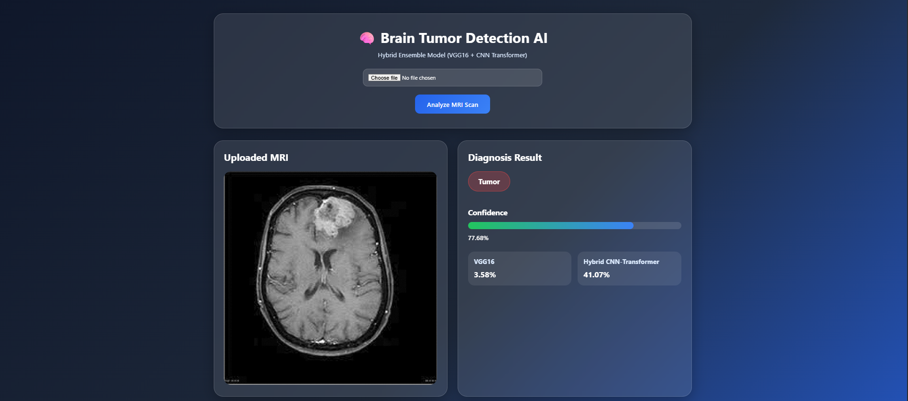
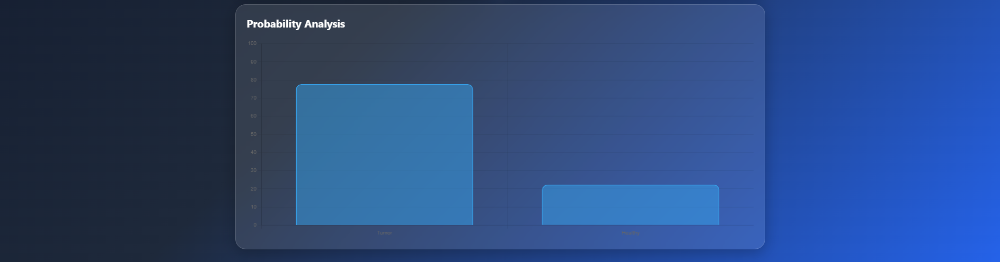

# 🧠 Brain Tumor Detection using Ensemble of VGG16 and Hybrid CNN-Transformer


## 📌 Overview

Brain Tumor Detection is a deep learning-based web application that detects brain tumors from MRI scans using an ensemble of two powerful models:

* VGG16 Transfer Learning Model
* Hybrid CNN-Transformer Model

The predictions from both models are combined through ensemble averaging to improve classification accuracy and reliability. Users can upload MRI images through a modern web interface and receive real-time predictions, confidence scores, and probability analysis.

---

## ✨ Features

* Upload MRI brain scan images through a web interface
* Detect Tumor or Healthy brain conditions
* Ensemble prediction using VGG16 and Hybrid CNN-Transformer
* Real-time confidence score generation
* Interactive probability visualization using Chart.js
* MRI image preview before analysis
* Modern glassmorphism-inspired UI
* Flask-based deployment-ready application

---

## 📸 Application Screenshots

<table>
<tr>
<td align="center">
<b>Home Page and Prediction Result</b><br><br>

</td>

<td align="center">
<b>Graphical Result</b><br><br>

</td>
</tr>
</table>

### Home Page

The application allows users to upload MRI scans and perform real-time brain tumor detection using an ensemble deep learning model.

### Prediction Result

After image upload, the system displays the predicted class, confidence score, model outputs, and probability analysis through interactive visualizations.

---

## 📊 Dataset Information

The model was trained and evaluated on a Brain MRI Dataset consisting of:

| Metric          | Count          |
| --------------- | -------------- |
| Total Images    | 5,093          |
| Training Images | 4,074          |
| Testing Images  | 1,019          |
| Classes         | Tumor, Healthy |

---

## 🏗️ Model Architecture

### 1. VGG16 Transfer Learning Model

* Pre-trained VGG16 backbone
* Global Average Pooling Layer
* Dense Layers
* Dropout Regularization
* Sigmoid Output Layer

**Accuracy Achieved:** 99.63%

---

### 2. Hybrid CNN-Transformer Model

* Convolutional Neural Network feature extraction
* Multi-Head Attention Transformer Block
* Layer Normalization
* Dense Classification Layers
* Sigmoid Output Layer

**Accuracy Achieved:** 59%

---

### 3. Ensemble Learning

Final predictions are generated by averaging outputs from both models:

```python
ensemble_prediction = (
    vgg_prediction + hybrid_prediction
) / 2.0
```

**Final Ensemble Accuracy:** 99.7%

---

## ⚙️ Tech Stack

### Backend

* Python
* Flask
* TensorFlow
* NumPy
* OpenCV

### Frontend

* HTML5
* CSS3
* JavaScript
* Chart.js

### Deep Learning

* VGG16
* CNN-Transformer
* Ensemble Learning

### Deployment

* Render
* GitHub

---

## 📂 Project Structure

```text
Brain_tumor_detection/
│
├── app.py
├── requirements.txt
├── Procfile
├── render.yaml
│
├── brain_tumor_vgg16.h5
├── brain_tumor_hybrid_cnn_transformer.h5
│
├── images/
│   ├── home_pred.png
│   └── graph.png
│
├── templates/
│   └── index.html
│
└── static/
    ├── style.css
    └── uploads/
```

---

## 🚀 Installation

### Clone Repository

```bash
git clone https://github.com/your-username/Brain_tumor_detection.git
cd Brain_tumor_detection
```

### Install Dependencies

```bash
pip install -r requirements.txt
```

### Run Application

```bash
python app.py
```

Open your browser and visit:

```text
http://127.0.0.1:5000
```

---

## 🧪 How It Works

1. User uploads an MRI scan.
2. Image is preprocessed and resized to 150×150 pixels.
3. VGG16 model generates a prediction.
4. Hybrid CNN-Transformer model generates a prediction.
5. Predictions are averaged using ensemble learning.
6. Final classification and confidence score are generated.
7. Results are displayed with probability analysis charts.

---

## 📈 Results

| Model                  | Accuracy |
| ---------------------- | -------- |
| Hybrid CNN-Transformer | 59%      |
| VGG16                  | 99.63%   |
| Ensemble Model         | 99.7%    |

The ensemble approach improved robustness and achieved the highest overall performance among all tested architectures.

---

## 🔮 Future Enhancements

* Multi-class brain tumor classification
* Grad-CAM explainability visualization
* PDF report generation
* Patient history management
* Cloud-based model serving
* Medical imaging dashboard

---

## 👨‍💻 Author

**Rohit Singh Rawat**

Developed as a deep learning and computer vision project for automated brain tumor detection using ensemble learning techniques.

---

## ⭐ Support

If you found this project useful, consider giving it a star on GitHub.
